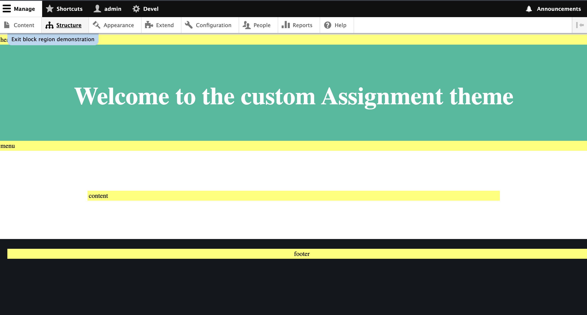
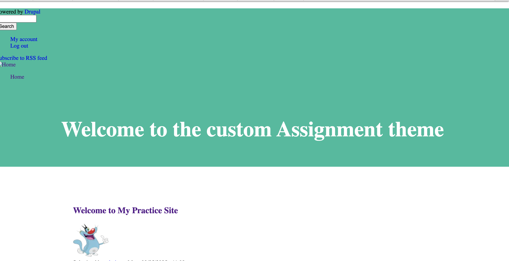

# My Custom Drupal Theme

A lightweight custom Drupal theme built for assignment to showcase very basic theme.  
This theme is designed as a starting point for Drupal projects, with clean structure and minimal CSS so developers can extend it easily.

---

## Features

- Minimal base styles (clean and simple layout).
- Customizable header, footer, and sidebar regions.
- Twig templates for easy customization.
- Drupal 10+ compatible.

---

## File Structure

```
drupal_project/
└── web/
    └── themes/
        └── custom/
            └── assignment/ #  custom theme directory
                    ├── assignment.info.yml
                    ├── assignment.libraries.yml
                    ├── templates/ # Twig template
                            └── page.html.twig
```

---

## Installation

1. Copy the `assignment` folder to your Drupal themes directory:
2. Clear Drupal cache:
3. Enable the theme in the **Appearance** section of your Drupal admin.

---

## Customization

- Edit `css/global.css` to change base styling.
- Modify `templates/page.html.twig` for layout adjustments.
- Add more template overrides as needed (`node.html.twig`, `block.html.twig`, etc.).

---

## Images

<div align="center" >
  <p>Image1</p>
  
  <p>Image2</p>
  
</div>

<!-- 
 -->

## License

Open source. Feel free to use and modify for your projects.
